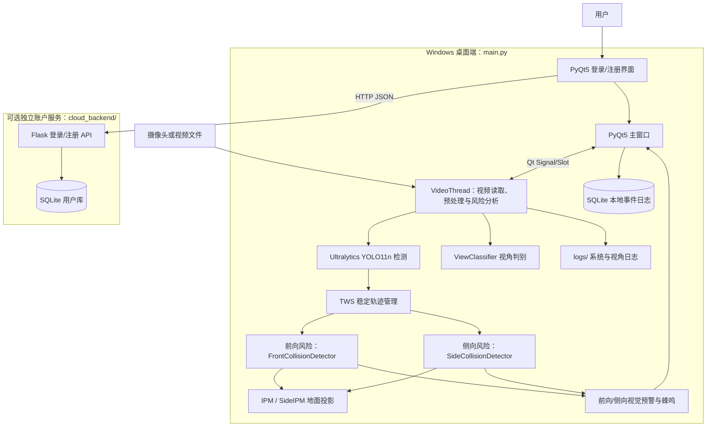

# FastGuard 系统架构与相关论文

本文根据仓库当前代码整理，描述默认启动路径和已存在的算法实现。它不把 README 中的功能规划、预留组件或其他版本的实现当作当前默认行为。

## 1. 系统概览

FastGuard 是一个以 Python 桌面端为主的单目/双目视频碰撞风险提示程序。默认入口为 `run_fastguard.bat` → `main.py`；账户后端 `cloud_backend/` 是可独立部署的 Flask 服务，不是桌面端视频处理的必需依赖。

## 2. 启动和运行流程

1. `run_fastguard.bat` 在仓库目录运行 `main.py`；若项目虚拟环境存在则优先使用，否则尝试系统 Python。
2. `main.py` 创建 PyQt 应用、本地日志库和云端账户客户端。云端可连接时显示登录/注册窗口；云端未配置或不可连接时，按现有逻辑跳过登录并以本地管理员身份进入。
3. 主窗口按需创建 `VideoThread`，通过 Qt 信号槽将视频帧、TTC、风险提示、处理延迟、播放进度和日志更新送回界面。
4. `VideoThread.run()` 打开摄像头或视频文件，逐帧预处理、运行检测和风险分析，并生成原始画面、预处理画面、推理标注画面及 BEV 画面。
5. 退出或停止监控时由主窗口控制处理线程和报警状态；日志分别写入 SQLite 以及 `logs/` 下的文本日志。

## 3. 视频感知与风险分析数据流

### 3.1 视频处理与目标检测

- 视频输入由 OpenCV `VideoCapture` 读取。
- 单目分支将画面分为有重叠区域的上下图块处理，复用增强/检测结果以减少计算；预处理包含灰度、CLAHE、中值滤波和 Sobel 边缘强度等步骤，具体处理会按帧调度。
- SBS 双目分支按宽高比识别左右图，计算 StereoSGBM 视差，并使用 `model.track(..., tracker="bytetrack.yaml")`。
- 默认分支使用 Ultralytics YOLO 权重（仓库包含 `assets/weights/yolo11n.pt`）进行目标检测；代码中实际推理设备目前指定为 CPU。
- 检测框经类别/位置/置信度过滤和重叠区域 NMS 后送入 `TWSManager`，获得稳定 ID、轨迹状态和短时外推结果。单目分支调用 `model.predict()`，因此不能笼统描述为每帧都使用 ByteTrack；ByteTrack 配置出现在 SBS 分支。

### 3.2 视角判断

`ViewClassifier` 将输入缩放至约 160×120，分析左右边缘和中心区域的帧间变化，并结合历史窗口、置信度和驻留/迟滞状态决定视角及侧向锚点。

**当前默认并非自动切换**：`core/view_classifier.py` 中 `FORCE_PERSPECTIVE` 设为 `"前向视角"`，分类器初始化时会锁定前向视角。将其设为 `None` 才会启用该分类器的自动判别逻辑；README 中“摄像头朝向自动判断”的表述应结合此开关理解。

### 3.3 前向风险评估

`FrontCollisionDetector` 为每个稳定轨迹维护目标宽度、中心位置等短时历史，通过目标框宽度增长率估算 TTC，并对宽度变化做 EMA 平滑。它还结合目标面积、画面中心通道、相对运动、可选 IPM 地面距离和安全距离参数筛选风险。主要输出包括 TTC、像素速度、风险级别及是否位于行驶通道。

`FrontAlarm` 对风险显示进行连续帧确认/消抖，绘制前向预警线和目标框显示状态。代码中驾驶员反应时间、安全冗余距离和本车速度有默认值；本车速度目前是用于演示/算法计算的固定模拟值，不是车辆总线实时车速。

### 3.4 侧向风险评估

`SideIPM` 根据左右相机配置，将目标框靠近车身一侧的底角投影到地面坐标；`SideCollisionDetector` 使用轨迹历史估计横纵向速度、靠近状态、盲区范围及 TTL（侧向侵入时间），形成 0/1/2 风险级别。`SideAlarm` 负责侧向安全线、车身壁垒显示与预警消抖。

IPM 采用针孔相机参数和相机安装高度、俯仰角、偏航角将像素射线与地面平面求交。距离精度依赖这些参数、地面近似平坦及相机安装姿态；项目默认值不是针对具体车辆自动标定的结果。

### 3.5 输出与停止监控提示

- `CollisionAlarm` 在独立线程中驱动 Windows `winsound.Beep`；前向/侧向告警状态和 TTC 经 Qt 信号更新 GUI。
- `EgoMotionDetector` 根据全局帧差和自适应阈值判断本车/相机是否停止；停止时 `StoppedSentinel` 对配置的安全区做帧差运动分级，并把提示送到界面。
- BEV（鸟瞰）视图依据 IPM 投影和目标风险状态绘制，用于辅助观察，并不代表独立传感器测量结果。

## 4. 模块与数据存储

| 路径 | 职责 |
|---|---|
| `main.py` | 默认应用入口；包含 PyQt 主界面和实际使用的 `VideoThread` 实现 |
| `ui_main.py` | 仓库中的另一套界面入口/实现；批处理脚本默认不启动它 |
| `core/front_detector.py` | 前向 TTC 与风险状态计算 |
| `core/side_detector.py` | 侧向 BSD/TTL 风险状态计算 |
| `core/view_classifier.py` | 视角判别、置信度和侧向锚点 |
| `core/tws.py` | 检测轨迹的 ID 稳定化和短时外推 |
| `core/ipm.py`, `core/side_ipm.py` | 前向/侧向像素与地面坐标换算 |
| `core/front_alarm.py`, `core/side_alarm.py`, `core/alarm.py` | 视觉预警、消抖和声音告警 |
| `core/ego_motion.py`, `core/stopped_sentinel.py` | 停车状态检测与静止安全区运动提示 |
| `auth/cloud.py`, `auth/ui.py` | 桌面端云端账户 API 客户端和登录界面 |
| `auth/db.py` | 桌面端 SQLite 事件日志；不保存云端用户账户 |
| `cloud_backend/app.py`, `cloud_backend/db.py` | 独立 Flask 账户 API 与 SQLite 用户存储 |
| `assets/weights/`, `bytetrack.yaml` | 检测权重和跟踪器配置 |

本地事件日志默认保存在 `data/fastguard.db`；运行/视角诊断文本日志保存在 `logs/`。账户服务用户库默认位于 `cloud_backend/cloud_users.db`（可由环境变量覆盖），与桌面端日志库分离。桌面端云端地址和 API 路径由 `data/cloud_auth.json` 配置。

## 5. 相关论文与实现对应关系

以下论文用于解释项目采用或参考的技术，不表示论文方法已被完整复现，也不构成系统安全性或道路适用性的验证。

| 主题 | 文献 | 与本项目的关系 |
|---|---|---|
| 单目 TTC / 视觉扩张 | M. Kilicarslan, J. Y. Zheng, “Predict Vehicle Collision by TTC From Motion Using a Single Video Camera,” *IEEE Transactions on Intelligent Transportation Systems*, 20(2), 522–533, 2019. [DOI: 10.1109/TITS.2018.2819827](https://doi.org/10.1109/TITS.2018.2819827) | 与项目以单目图像中的目标尺度变化估算 TTC 的方向相关；项目实际用检测框宽度历史等启发式量，不等同于论文中的完整运动估计方法。 |
| 多目标跟踪 | Y. Zhang et al., “ByteTrack: Multi-Object Tracking by Associating Every Detection Box,” *ECCV 2022*. [arXiv:2110.06864](https://arxiv.org/abs/2110.06864) | 项目在 SBS 双目检测路径中配置了 Ultralytics ByteTrack；单目路径主要由项目内 `TWSManager` 稳定检测轨迹。 |
| 逆透视 / BEV | T. Bruls et al., “The Right (Angled) Perspective: Improving the Understanding of Road Scenes Using Boosted Inverse Perspective Mapping,” [arXiv:1812.00913](https://arxiv.org/abs/1812.00913) | 背景参考：讨论 IPM/BEV 的道路场景理解及传统投影的局限。项目的 `IPM_Transformer` 是基于针孔射线与平面求交的简化投影，不是论文的 Boosted IPM 方法。 |
| 坐标注意力 | Q. Hou, D. Zhou, J. Feng, “Coordinate Attention for Efficient Mobile Network Design,” *CVPR 2021*. [arXiv:2103.02907](https://arxiv.org/abs/2103.02907) | `core/dl_components.py` 中有 CoordAtt 组件原型；当前 YOLO 权重推理没有将该组件接入模型结构。 |
| 空间 CNN | “Spatial As Deep: Spatial CNN for Traffic Scene Understanding,” *AAAI 2018*. [arXiv:1712.06080](https://arxiv.org/abs/1712.06080) | 同文件包含简化版 `SCNN_Block`；当前默认检测模型没有集成该模块。 |
| SIoU 框回归损失 | “SIoU Loss: More Powerful Learning for Bounding Box Regression,” 2022. [arXiv:2205.12740](https://arxiv.org/abs/2205.12740) | 仓库中 `calculate_siou()` 目前是返回 `0.0` 的占位实现，未用于训练或推理；此文献属于代码命名相关的参考，不应视为项目已实现 SIoU。 |

### YOLO11 说明

项目包含 Ultralytics YOLO11n 权重并通过 Ultralytics API 加载。Ultralytics 未为 YOLO11 发布正式学术论文，因此应引用其[官方 YOLO11 文档](https://docs.ultralytics.com/models/yolo11/)和[代码仓库](https://github.com/ultralytics/ultralytics)，而不要将第三方综述误写成官方 YOLO11 论文。

## 6. 当前实现边界

- 系统输出是基于单目图像/可选 SBS 视差、默认标定参数和启发式阈值的风险提示；不是经过功能安全认证的 ADAS，也不能替代驾驶员观察或车规传感器。
- 车辆速度默认值为模拟值；IPM 距离受到相机参数及地面条件影响。
- 自动视角切换受 `FORCE_PERSPECTIVE` 开关控制，仓库默认锁定前向视角。
- 默认线程推理设备为 CPU；README 中关于 GPU 异步加速的描述不应作为当前默认实现的保证。
- `core/calculator.py` 和 `core/dl_components.py` 含有非默认路径/原型代码；需要结合调用关系区分其与 `main.py` 默认运行流程。
